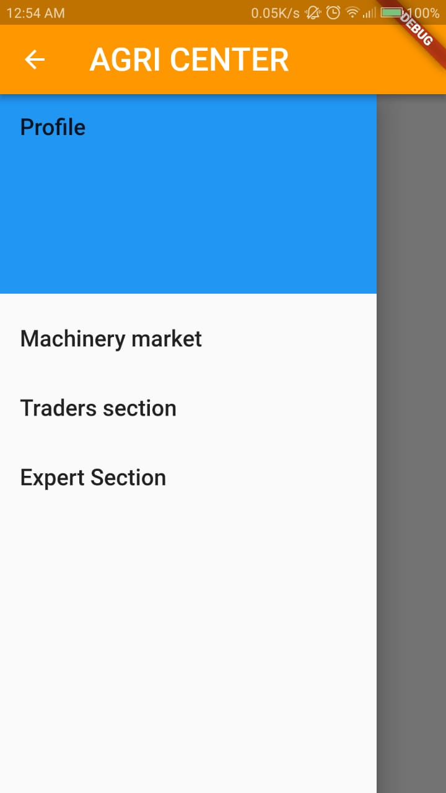
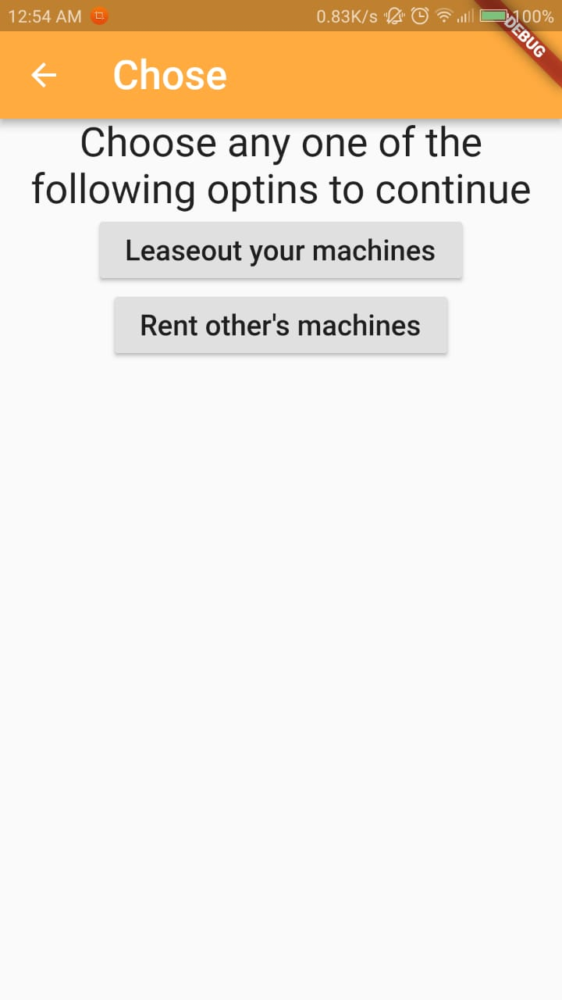

**Description:**
We are developing an native application using flutter. Our application aims to provide support to the agriculture community. Here the agriculturists can rent or lease farm machinery , look into the needs of a retailer in the nearest market and a QnA section to seek expert advice from a researcher.
At the retailer’s end the retailer can propose needs and specify all his requirements such as type of commodity, quantity , quality and the date before which its required.
We will be starting our application from scratch.

# Dependencies
## flutter:
##    sdk: flutter
##  cached_network_image:
##  url_launcher:

# **OVERVIEW**
In the **main.dart of the LIB directory** we the main function of the project is defined.
We have the Drawer widget in the main function which has the options shown in the screenshot.
Each of them is clickable which will take you to new Layout

# **Machinery Market**
This takes you to the new dart file called  LeaseRent.dart of LIB directory
In this page you need to choose weather you need to
1)Leaseout your vehicles
2)Rent other's vehicles for your use

# **Lease out your vehicles**
It is defined in the **lease.dart** of lib folder
Leasout your vehicles would want you to enter the vehicle details like the vehicle type,location, hourly changes and contact details

# **Rent others machinery**
It is defined in the **new1.dart** of lib folder
Here you can rent other machinery and call them if interested    

# **Traders Section**
Here the details proposed by the trader is described
